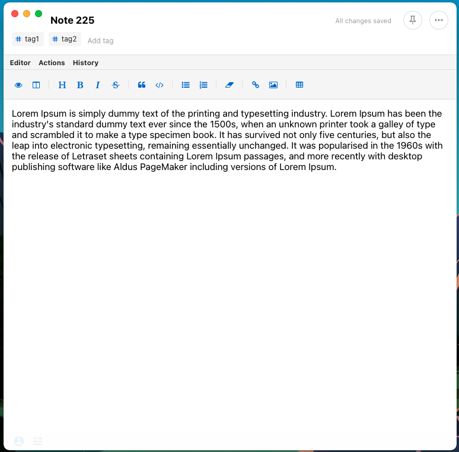

# No Distraction Theme

Narrows your focus to the current note you're working on.



## Installation

Install the following Extenion URL:

```
https://raw.githubusercontent.com/mindovermiles262/no-distraction-theme/master/ext.json
```

## Building

Make any changes to the `src/main.css` file, update the version in `ext.json` and `package.json`, then zip:

```
$ cd no-distraction-theme
$ zip -r no-distraction-theme-[MAJOR]-[MINOR]-[PATCH].zip \
      . \
      -x "*.git*"
``

Once, zipped, push to Github and create a new release, uploading the zipped file.

The URL and version inside of `ext.json` should point to the download location of the zip file you host in Gitlab. The version specified in `package.json` will tell SN which verison is running.
